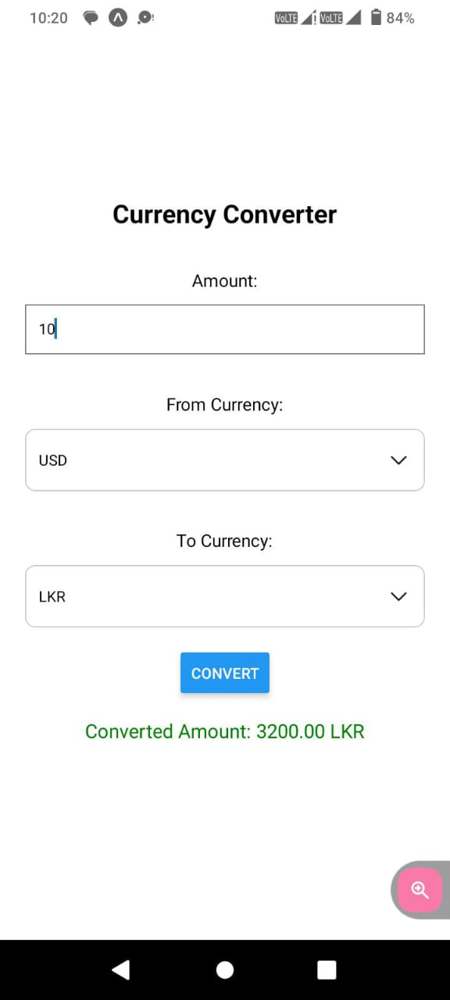

# React Native Currency Converter App

This React Native project is a **Currency Converter** app that allows users to convert between different currencies (USD, LKR, EUR) using predefined rates. The app uses dropdown menus for currency selection, providing a seamless and interactive user experience.

---

## Features

1. **Currency Conversion**  
   - Converts between USD, LKR, and EUR using predefined rates.

2. **Input Validation**  
   - Ensures the entered amount is valid and numeric.

3. **Dynamic Dropdowns**  
   - Utilizes `react-native-dropdown-picker` for selecting currencies.

4. **Real-Time Results**  
   - Displays the converted amount immediately after clicking the **Convert** button.

5. **Error Handling**  
   - Shows error messages for invalid or missing input.

---

## Component Breakdown

### `App.js`  
The main component containing the app's logic and UI.

#### **State Variables**
- `amount`: Stores the input amount.  
- `fromCurrency` and `toCurrency`: Manage the selected currencies.  
- `convertedAmount`: Stores the result of the conversion.  
- `error`: Tracks validation errors.  
- `fromCurrencyOpen` and `toCurrencyOpen`: Control the dropdown states.

#### **Key Features**
1. **Conversion Rates**: Predefined rates for currency conversion.  
2. **Conversion Functionality**:  
   - Validates input.  
   - Calculates the converted amount based on the selected currencies.  
   - Updates the result or displays an error.  
3. **Dropdown Menus**:  
   - Allows users to select "from" and "to" currencies dynamically.  

#### **UI Components**
- Text input for the amount.  
- Dropdowns for currency selection using `react-native-dropdown-picker`.  
- Convert button to perform the conversion.  
- Display sections for the result and error messages.

---

## Workflow

1. **User Input**  
   - User enters the amount in the text input.

2. **Currency Selection**  
   - User selects the source and target currencies from dropdown menus.

3. **Conversion**  
   - Clicking the "Convert" button triggers validation and conversion logic.

4. **Output**  
   - Displays the converted amount or an error message.

---

## Styling

- **Container**  
  - Centers the app content using `flexbox`.  
  - Applies padding and a clean, white background.  

- **Input Field**  
  - Styled with borders for clarity and usability.  

- **Dropdowns**  
  - Customized using `react-native-dropdown-picker` styles.  

- **Result and Error Text**  
  - Displays the converted amount in green and errors in red.

---

## Output

